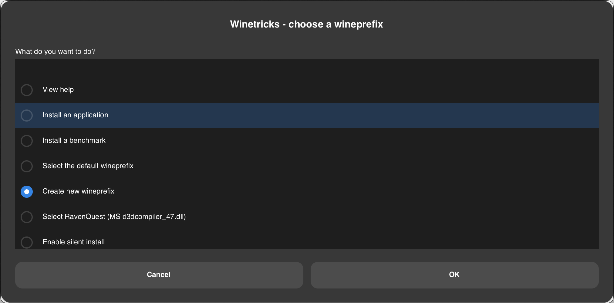

# How to play RavenQuest on Macintosh using Wine

*A guide written by Urdhi for the RavenQuest community :heart:*  
*1.0.0 2024-11-01*


# Table of Contents
1. [Prerequisites](#prerequisites)
2. [Installing Wine](#installing-wine)
3. [Creating Wine-Prefix](#creating-wine-prefix)
4. [Installing RavenQuest](#installing-ravenquest)
5. [Creating Shortcut](#creating-shortcut)


## Prerequisites
Before getting started, make sure you meet these requirements:

1. **A Macintosh**:
  This guide is tested on a MacBook Pro 2019 with Intel Core i9 processor and macOS 15.1, *Apple Silicon processor is not tested yet*.

2. **Homebrew**:
  The Missing Package Manager for macOS, get it from [https://brew.sh](https://brew.sh).

3. **Internet Connection**: A stable connection is necessary for downloading Wine and the game itself.


## Installing Wine
Install Wine, Winetricks and Zenity (GUI framework for running Winetricks) via Brew:
 ```BASH
 brew install wine-stable winetricks zenity
 ```


## Creating Wine-Prefix
Follow these steps to create a Wine-prefix for your game with the necessary dependencies:

- Execute the command `winetricks` in your console, the GUI will open.  
- Select `Create a new wineprefix` and click on OK:



- Enter the name of your prefix and select architecture 64.  
  *This is important due to Apple has dropped 32-bit support and it's not possible to create 32-bit prefixes anymore.*


- Select `Install a Windows DLL or component` and click on OK:


- Select the package `d3dcompiler_47` and click on OK:


## Create Wine-Prefix
Follow these steps to install and set up **RavenQuest**:

 - Download the game installer (EXE file) from [RavenQuest’s website](https://ravenquest.io).
 - In Winetricks scroll down in the list of the previously created prefix and select `Run an arbitrary executable (.exe/.msi/.msu)` and click on OK:

 

 - Run the RavenQuest installer, configure it as needed. If you don't uncheck *launch game* the game will immediately launch and crash, that's fine.

 - To start the game select in Winetricks `Run an arbitrary executable (.exe/.msi/.msu)` again, navigate to your prefix and select *ravenquest_dx.exe*. Repeat this step until the automatic client patching on startup is done.  
  If the default settings are unchanged, the prefix is located in the folder `~/.local/share/wineprefixes/RavenQuest/drive_c/Program Files (x86)/Tavernlight Games/RavenQuest`. To display the hidden `.local` folder in the Finder, press `Shift` + `Command` + `. (Dot)`.


## Creating Shortcut
Follow these steps to create an application shortcut to quickly access **RavenQuest**:

- Open Apple **Automator** (found in Applications > Utilities).
- Choose **Application** as the type of document to create.


- In the search bar, type `Run Shell Script` and double-click on it to add it to the workflow.
- In the textarea insert following script and replace the variable `<USERNAME>`:

```BASH
# Path to Wine prefix
WINE_PREFIX="/Users/<USERNAME>/.local/share/wineprefixes/RavenQuest"

# Path to executable
WINE_EXECUTABLE="/Users/<USERNAME>/.local/share/wineprefixes/RavenQuest/drive_c/Program Files (x86)/Tavernlight Games/RavenQuest/ravenquest_dx.exe"

# Run executable using Wine
WINEPREFIX="$WINE_PREFIX" /usr/local/bin/wine64 "$WINE_EXECUTABLE"
```


- Save the Automator application with a name like “RavenQuest”. Choose a location, like your Desktop or Applications folder.

- (Optional) Create a Custom Icon for Your Shortcut
  - Find or create an image for the icon.
  - Open the image in Preview, select the entire image (`Command` + `A`), and copy it (`Command` + `C`).
  - Right-click your Automator application and select "Get Info".
  - Click on the icon in the top left corner of the "Get Info" window and paste (`Command` + `V`).


---

*I hope this guide helps you and makes it easy for you to enjoy this fantastic game on your Mac. :apple: :heart:  
If you have any questions, please feel free to contact me in the Discord!*

*Spread the word, but please mention me as the author!*
