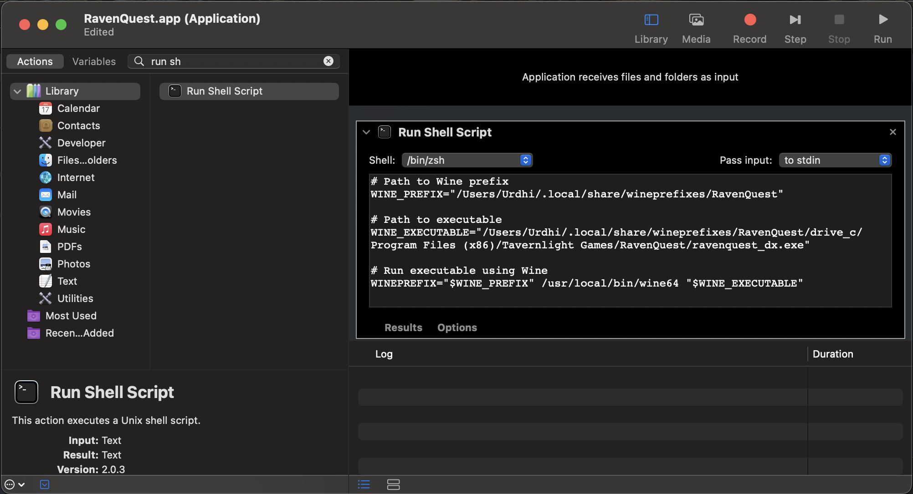

# How to play RavenQuest on macOS using Wine

*A guide written by Urdhi for the RavenQuest community :heart:*  
*1.1.2 2024-12-30*


# Table of Contents
1. [Prerequisites](#prerequisites)
2. [Installing Wine](#installing-wine)
3. [Creating Wine-Prefix](#creating-wine-prefix)
4. [Installing DXVK into Wine-Prefix](#installing-dxvk-into-wine-prefix)
5. [Installing RavenQuest](#installing-ravenquest)
6. [Creating Shortcut](#creating-shortcut)

If the setup seems too complicated for you or you already own CrossOver, I have created a separate guide for this:  
[https://github.com/Urdhi/RavenQuest-on-Mac-CrossOver-Guide](https://github.com/Urdhi/RavenQuest-on-Mac-CrossOver-Guide)


## Prerequisites
Before getting started, make sure you meet these requirements:

1. **A Macintosh**:
  This guide is tested on a MacBook Pro 2019 with an Intel Core i9 processor and macOS 15.1, but it should work on all Macs, including those with Apple Silicon.
  However, players on Apple Silicon devices have reported freezes after 30-60 minutes of gameplay.
  Using [CrossOver](https://github.com/Urdhi/RavenQuest-on-Mac-CrossOverGuide) appears to improve stability on these devices.
2. **Homebrew**:
  The Missing Package Manager for macOS, get it from [https://brew.sh](https://brew.sh).

3. **Internet Connection**: A stable connection is necessary for downloading Wine and the game itself.

## Installing Wine
Install Wine, Winetricks and Zenity (GUI framework for running Winetricks) via Brew:
 ```BASH
 brew install wine-stable winetricks zenity
 ```


## Creating Wine-Prefix
Follow these steps to create a Wine-prefix for your game with the necessary dependencies:

- Execute the command `winetricks` in your console, the GUI will open.  
- Select `Create a new wineprefix` and click on OK:


- Enter the name of your prefix and select architecture 64.  
  *This is important due to Apple has dropped 32-bit support and it's not possible to create 32-bit prefixes anymore.*


- Select `Install a Windows DLL or component` and click on OK:


- Select the package `d3dcompiler_47` and click on OK:


## Installing DXVK into Wine-Prefix
To enhance performance (reduce power consumption) and resolve certain graphical issues (e.g. black world map), DXVK should be installed and activated in the Wine prefix. Follow these steps:

- Download the latest DXVK package for Mac from this [GitHub repository](https://github.com/Gcenx/DXVK-macOS/releases/).

- Extract the downloaded package.  
 **Note:** *Be mindful of the reversed directory names for 32-bit and 64-bit files in the following steps!*

  - Copy the contents of the `x32` folder to `~/.local/share/wineprefixes/RavenQuest/drive_c/windows/syswow64`
  - Copy the contents of the `x64` folder to `~/.local/share/wineprefixes/RavenQuest/drive_c/windows/system32`


- Open Winetricks and select `Run winecfg` to launch the Wine configuration dialog (a Windows-like settings window).

- Navigate to the `Libraries` tab.

- Add the libraries `d3d11` and `d3d10core` to the list.

- Click `Apply` and close the configuration window.


## Installing RavenQuest
Follow these steps to install and set up **RavenQuest**:

- Download the game installer (EXE file) from [RavenQuest’s website](https://ravenquest.io).
- In Winetricks scroll down in the list of the previously created prefix and select `Run an arbitrary executable (.exe/.msi/.msu)` and click on OK:


- Run the RavenQuest installer, configure it as needed. If you don't uncheck *launch game* the game will immediately launch and crash, that's fine.

- To start the game select in Winetricks `Run an arbitrary executable (.exe/.msi/.msu)` again, navigate to your prefix and select *ravenquest_dx.exe*. Repeat this step until the automatic client patching on startup is done.  
If the default settings are unchanged, the prefix is located in the folder `~/.local/share/wineprefixes/RavenQuest/drive_c/Program Files (x86)/Tavernlight Games/RavenQuest`. To display the hidden `.local` folder in the Finder, press `Shift` + `Command` + `. (Dot)`.


## Creating Shortcut
Follow these steps to create an application shortcut to quickly access **RavenQuest**:

- Open Apple **Automator** (found in Applications > Utilities).
- Choose **Application** as the type of document to create.


- In the search bar, type `Run Shell Script` and double-click on it to add it to the workflow.
- In the textarea insert following script and replace the variable `<USERNAME>`:

```BASH
# Path to Wine prefix
WINE_PREFIX="/Users/<USERNAME>/.local/share/wineprefixes/RavenQuest"

# Path to executable
WINE_EXECUTABLE="/Users/<USERNAME>/.local/share/wineprefixes/RavenQuest/drive_c/Program Files (x86)/Tavernlight Games/RavenQuest/ravenquest_dx.exe"

# Run executable using Wine
WINEPREFIX="$WINE_PREFIX" /usr/local/bin/wine64 "$WINE_EXECUTABLE"
```



- Save the Automator application with a name like “RavenQuest”. Choose a location, like your Desktop or Applications folder.

- (Optional) Create a Custom Icon for Your Shortcut
  - Find or create an image for the icon.
  - Open the image in Preview, select the entire image (`Command` + `A`), and copy it (`Command` + `C`).
  - Right-click your Automator application and select "Get Info".
  - Click on the icon in the top left corner of the "Get Info" window and paste (`Command` + `V`).


---


Visit my community page [https://ravenquest.de](https://ravenquest.de)

*I hope this guide helps you and makes it easy for you to enjoy this fantastic game on your Mac. :apple: :heart:  
If you have any questions, please feel free to contact me in the Discord!*


*Spread the word but mention me as the author please!*  
